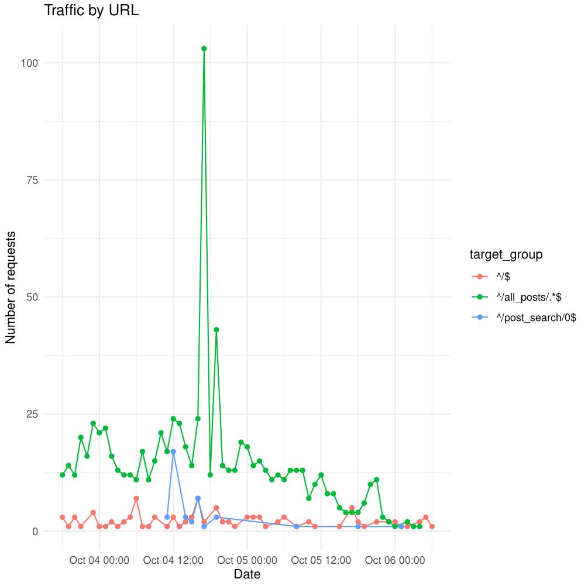
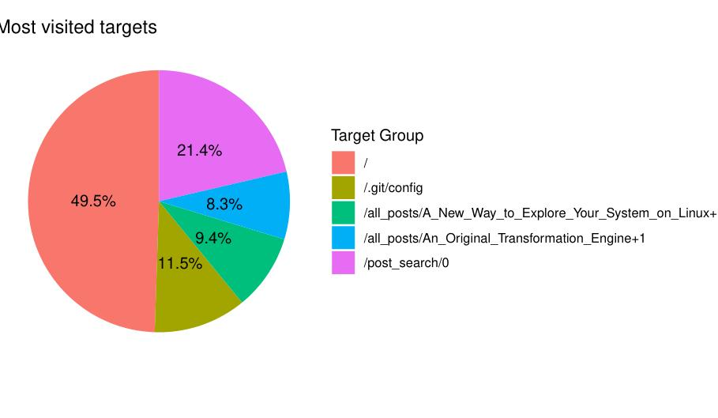

<h1>📊 Access Log Analyzer (R Script)</h1>

This R script analyzes web server access logs over customizable time intervals, generating PDF plots of URL traffic patterns using <code>ggplot2</code>.  
It supports filtering by date, target pages, and time intervals (hourly, daily, weekly, etc.).

<h2>🧩 Dependencies</h2>
<ul>
  <li><code>dplyr</code></li>
  <li><code>lubridate</code></li>
  <li><code>ggplot2</code></li>
  <li><code>optparse</code></li>
  <li><code>readr</code></li>
</ul>

<h2>⚙️ Command-Line Options</h2>

<table class="option-table">
  <thead>
    <tr><th>Option</th><th>Description</th><th>Default</th></tr>
  </thead>
  <tbody>
    <tr><td><code>-f, --file</code></td><td>Input log file</td><td><code>access.log</code></td></tr>
    <tr><td><code>-s, --start</code></td><td>Start of analysis window (format: <code>%d/%b/%Y:%H</code>)</td><td><code>01/Sep/1970:00</code></td></tr>
    <tr><td><code>-e, --ending</code></td><td>End of analysis window (format: <code>%d/%b/%Y:%H</code>)</td><td><code>01/Sep/2970:00</code></td></tr>
    <tr><td><code>-l, --last</code></td><td>Analyze only the last N time units (e.g., days, hours, etc.)</td><td><code>0</code> (disabled)</td></tr>
    <tr><td><code>-p, --pages</code></td><td>Target URL patterns (use <code>--</code> as separator between regex patterns)</td><td><code>.</code> (all pages)</td></tr>
    <tr><td><code>-m, --most</code></td><td>Show the top 5 most visited pages as a pie chart</td><td><code>.</code>FALSE</td></tr>
    <tr><td><code>-o, --outfile</code></td><td>Output PDF file name</td><td><code>out.pdf</code></td></tr>
    <tr><td><code>-i, --interval</code></td><td>Time aggregation interval:  
        <code>h</code> (hour), <code>d</code> (day), <code>w</code> (week),  
        <code>m</code> (month), <code>y</code> (year)</td><td><code>h</code></td></tr>
  </tbody>
</table>

<h2>🧠 Script Workflow</h2>
<ol>
  <li>Parse command-line arguments with <code>optparse</code>.</li>
  <li>Load and clean log data using <code>readr::read_delim()</code>.</li>
  <li>Filter out unwanted IPs and restrict the time window.</li>
  <li>Extract and normalize URL paths from log entries.</li>
  <li>Match target URLs using <strong>regular expressions (regex)</strong>:
    <ul>
      <li>Each expression in <code>--pages</code> is a valid regex pattern.</li>
      <li>Multiple expressions can be combined using <code>--</code> as a separator.</li>
      <li>Example: <code>'^/$--^/all_posts/.*$--^/post_search/0$'</code> will match any of those three patterns.</li>
    </ul>
  </li>
  <li>Group by date and target page.</li>
  <li>Aggregate hit counts over the selected interval (hour/day/week/month/year).</li>
  <li>Plot the results using <code>ggplot2</code> with line and point charts.</li>
  <li>Save the visualization to the specified PDF file.</li>
</ol>

<h2>📈 Output</h2>

The resulting PDF (<code>out.pdf</code> by default) contains a color-coded time series plot showing how traffic varies per target URL over the selected time period.

<h2>💡 Example Usage</h2>

<pre><code>logs_analyze ➤ Rscript convert.R \
  -l 60 \
  -p '^/$--^/all_posts/.*$--^/post_search/0$' \
  -i h \
  -f access.log
</code></pre>

This command:

<ul>
  <li>Analyzes the <strong>last 60 hours</strong> of data (<code>-l 60 -i h</code>).</li>
  <li>Focuses on three URL patterns:
    <ul>
      <li><code>^/$</code> (home page)</li>
      <li><code>^/all_posts/.*$</code> (all posts pages)</li>
      <li><code>^/post_search/0$</code> (specific post search endpoint)</li>
    </ul>
  </li>
  <li>Reads from <code>access.log</code> and outputs a PDF chart summarizing the hit frequencies.</li>
</ul>

